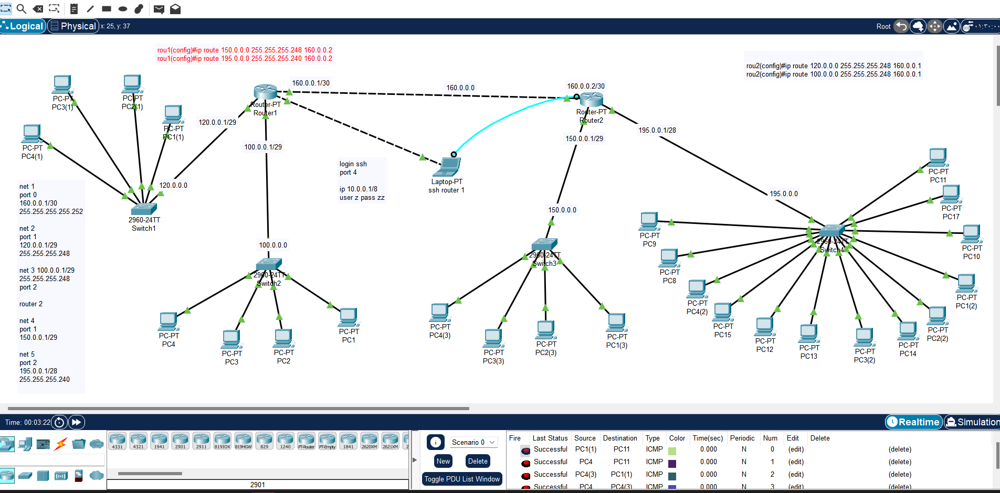

الوصف 

تم تكوين شبكة عبر طريقة يدوية (Static Routing) لتحديد مسار إرسال البيانات بين الشبكات البعيدة. في هذه الطريقة يقوم المسؤول بتعيين المسارات يدويًا بدلاً من أن يكتشفها الراوتر تلقائيًا، مما يعطي تحكمًا أكبر في حركة البيانات.

---

⚙️ مكونات المشروع:

🔹 Router 1

Port 0:

IP: 160.0.0.1

Subnet Mask: 255.255.255.252

تكوين SSH للوصول عن بعد:

Port 4:

IP: 10.0.0.1

Subnet Mask: 255.0.0.0

User: z / Password: zz

---

🔹 Router 2

Port 0:

IP: 160.0.0.2

Subnet Mask: 255.255.255.252

---

🔹 الشبكة الثانية (Switch 1)

Port 1:

IP: 120.0.0.1

Subnet Mask: 255.255.255.248

عدد العناوين الكلي: 6

القابلة للاستخدام: 4

---

🔹 الشبكة الثالثة (Switch 2)

Port 2:

IP: 100.0.0.1

Subnet Mask: 255.255.255.248

عدد العناوين الكلي: 6

عدد الأجهزة: 4

---

🔹 الشبكة الرابعة (Switch 3 على Router 2)

Port 1:

IP: 150.0.0.1

Subnet Mask: 255.255.255.248

عدد العناوين الكلي: 6

عدد الأجهزة: 4

---

🔹 الشبكة الخامسة (Switch 4)

Port 1:

IP: 195.0.0.1

Subnet Mask: 255.255.255.240

عدد العناوين الكلي: 16

القابلة للاستخدام: 14

عدد الأجهزة: 13

عدد الشبكات: 5 شبكات.

عدد الراوترات: 2.

عدد السويتشات: 4.

تم تكوين Static Routing على الراوترات باستخدام:

ip route [Network] [Subnet Mask] [Next-Hop-IP]

تم اختبار الاتصال (Ping) بين جميع الشبكات للتأكد من الربط

ملاحظة 📝  
لقد تم ارفق المشروع stat.pkt
